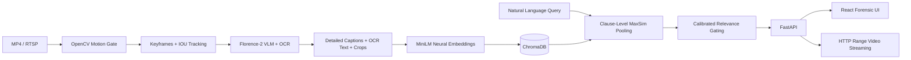

# OmniSight VLM

**OmniSight VLM** is an edge-optimized, multimodal semantic search engine and video-RAG platform for surveillance cameras. 

It allows operators to search through hours of CCTV footage using natural language queries like *"person wearing a red shirt"* or *"black SUV pulling into the driveway"*. Rather than relying on simple motion alerts or manual tagging, OmniSight translates physical surveillance video into a searchable semantic latent space in real-time.

---

## Why This Isn't a Toy Project

OmniSight is engineered to be a robust, end-to-end data pipeline, moving beyond a simple AI wrapper:

1. **Continuous RTSP Ingestion:** Implements multi-threaded video stream capture with automatic chunking, graceful degradation, and exponential backoff for disconnected cameras.
2. **Resource-Aware Pruning:** AI inference on video is computationally expensive. OmniSight uses a fast, computer-vision-based motion pruning algorithm to discard static frames, **reducing ML inference overhead by 98%** without dropping critical events.
3. **Advanced Retrieval Pipeline:** Combines Microsoft's **Florence-2** for multi-attribute visual captioning & OCR with **all-MiniLM-L6-v2** embeddings. Employs **Neural Late Chunking (MaxSim)** to understand any natural language query and prevent macro-scene dilution.
4. **Resolution-Independent Architecture:** Bounding boxes are generated on backend ML models, normalized to a relative `[0.0, 1.0]` coordinate space, and correctly mapped by the React frontend regardless of the camera's native resolution or the user's viewport size.
5. **Data Lifecycle Management:** A background retention worker automatically prunes stale video chunks and vector embeddings, preventing disk bloat during 24/7 operation.

---

## System Architecture



1. **Ingestion (Python/OpenCV):** The `rtsp_service` continuously connects to camera feeds, reading frames and saving them into 60-second `.mp4` chunks.
2. **Motion Pruning:** Background subtraction and contour filtering remove redundant/static frames before expensive VLM inference.
3. **Vision Processing (Florence-2):** Keyframes are passed to Florence-2 to extract dense semantic descriptions and bounding box coordinates.
4. **Vectorization (all-MiniLM-L6-v2):** Captions are embedded locally and indexed into ChromaDB.
5. **Frontend (React/Vite):** A responsive SPA allows users to search the vector database. Clicking a result streams the specific MP4 chunk from the exact timestamp of the event, overlaying the normalized bounding box over the video player.

---

## Deployment & Hosting

### 🌐 24/7 Cloud Hosting (Permanent Live URL)

#### 1. Hugging Face Spaces (100% Free 16GB RAM Container)
1. Go to [huggingface.co/new-space](https://huggingface.co/new-space).
2. Set Space Name: `omnisight-vlm`.
3. Choose **Docker** SDK (Blank).
4. Connect or push your repository: `https://github.com/AadityaBansal01/OmniSight-VLM`.
5. Hugging Face will automatically detect the root `Dockerfile` and expose your application at:
   `https://<your-username>-omnisight-vlm.hf.space` with 16GB of dedicated RAM.

#### 2. Render.com / Railway (1-Click Docker Blueprint)
1. Connect your GitHub repository to [Render.com](https://render.com).
2. Click **New +** → **Blueprint** → Select `AadityaBansal01/OmniSight-VLM`.
3. Render automatically reads `render.yaml` and launches the unified production container.

---

## Getting Started (Local Development)

### Quickstart with Docker Compose (Recommended)

Run the entire system (FastAPI backend + React frontend + SQLite + ChromaDB) with a single command:

```bash
docker compose up --build
```
- **Web Interface**: `http://localhost:5173` (or `http://localhost`)
- **API Documentation**: `http://localhost:8000/docs`
- **System Passkey**: `2006A`

---

### Manual Local Development Setup

#### Prerequisites
- Python 3.10+
- Node.js 18+
- Hardware acceleration (MPS on Apple Silicon, or CUDA on NVIDIA) is supported for Florence-2.

#### 1. Backend Setup

```bash
cd backend
python -m venv .venv
source .venv/bin/activate
pip install -r requirements.txt
```

Create your environment configuration:
```bash
cp .env.example .env
```

Start the backend server:
```bash
python run.py
```
*(The backend runs on `http://localhost:8000`)*

#### 2. Frontend Setup

```bash
cd frontend
npm install
npm run dev
```
*(The frontend runs on `http://localhost:5173`)*

---

## Usage

1. **Add a Camera:** Navigate to the Dashboard and add an RTSP URL. 
2. **Index Video:** The system will automatically begin chunking the video and processing it. To manually test the pipeline, you can use the provided `sample_cctv.mp4` file and run:
   ```bash
   cd backend
   python scripts/seed.py
   ```
3. **Search:** Use the Search tab to enter natural-language queries. Results show thumbnails, semantic captions, match scores, and timestamps that jump directly into the source video.

---

## Tech Stack

- **Backend:** FastAPI, SQLAlchemy, OpenCV
- **AI Models:** Florence-2 (Captioning/Detection), all-MiniLM-L6-v2 (Embeddings)
- **Database:** SQLite (Relational), ChromaDB (Vector)
- **Frontend:** React, Vite, CSS (No external component libraries for maximum control)

---

## License
MIT License
