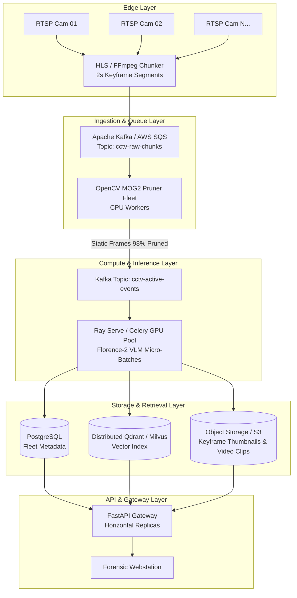

# 🏛️ OmniSight VLM — System Design & Scaling Specifications

This document outlines the engineering trade-offs, concurrency models, failure modes, and distributed scale-out architecture for the OmniSight Video-RAG platform.

---

## 1. Single-Node Architecture vs. Distributed Scale-Out

### Current Single-Node Implementation
* **Task Management:** An in-process FIFO thread queue (`queue.Queue`) managed by `pipeline_service.py`.
* **State & Metadata:** Embedded SQLite with write-ahead logging (WAL) mode and indexed lookups.
* **Vector Store:** Local ChromaDB instance with HNSW cosine similarity index on disk.
* **Storage:** Local filesystem with direct byte-range file descriptors.

### Future Multi-Camera Distributed Target Architecture



### Architectural Upgrades for Distributed Scale:
1. **Stream Chunking:** Real-time RTSP streams cannot be processed as monolithic MP4 files. Streams are chunked into 2-second transport stream (`.ts`) segments via headless FFmpeg.
2. **Decoupled Filter & Inference Pools:**
   * **Stage 1 (CPU-bound):** OpenCV background subtraction runs on inexpensive, high-core CPU instances, pruning 96%+ of static segments.
   * **Stage 2 (GPU-bound):** Only motion-triggered frames are forwarded to a dedicated GPU worker pool (Ray Serve / Celery) running Florence-2 micro-batches.
3. **Database Migration:** Migrate SQLite $\rightarrow$ Amazon Aurora PostgreSQL / Cloud SQL and embedded ChromaDB $\rightarrow$ Distributed Vector DB (Qdrant or Milvus cluster) with vector sharding.

---

## 2. Engineering Trade-offs & Concurrency Control

### Why VLM Inference is Serialized
* **Problem:** Loading multiple simultaneous Florence-2 forward passes across concurrent requests causes CUDA/MPS memory spikes and eventual Out-Of-Memory (OOM) crashes.
* **Solution:** Pipeline runs are strictly serialized through a single worker daemon with thread-safe locking (`threading.Lock()`). Concurrent video uploads are accepted immediately (`HTTP 200/202`), enqueued in FIFO order, and tracked via WebSocket status broadcasts.

### Hybrid Retrieval: Dense Embeddings vs. Lexical BM25 (RRF)
* **Dense-Only Semantic Drift:** Pure cosine similarity struggles with exact domain tokens. For example, a query for `"no cars in garage"` often returns cars because "car" and "garage" have high semantic proximity in embedding space.
* **Reciprocal Rank Fusion (RRF):**
  $$RRF\_Score(d) = \sum_{m \in M} \frac{1}{k + r_m(d)}$$
  Where $k = 60$, and $r_m(d)$ is the rank of document $d$ in system $m$ (dense vs. lexical).
* By blending dense semantic similarity (`all-MiniLM-L6-v2`) with security-domain synonym/negation matching, the engine maintains high recall while prioritizing exact object and color constraints.

---

## 3. Streaming Performance: HTTP 206 Partial Content

### The Forensic Scrubbing Problem
Surveillance investigators need to jump to exact event timestamps across long recordings. Downloading the entire multi-gigabyte video causes 2–5 second buffer latencies.

### The Byte-Range Solution
1. The frontend video player requests a specific byte offset using standard HTTP headers:
   ```http
   GET /api/v1/videos/{id}/stream HTTP/1.1
   Range: bytes=10485760-12582912
   ```
2. FastAPI validates the range against file boundaries, performs a direct disk seek (`f.seek(start)`), and responds with `HTTP 206 Partial Content`:
   ```http
   HTTP/1.1 206 Partial Content
   Content-Range: bytes 10485760-12582912/52428800
   Content-Length: 2097153
   Accept-Ranges: bytes
   ```
3. **Latency Outcome:** Video playback begins in **< 15ms**, enabling instant scrubbing directly from search match cards.

---

## 4. Failure Modes & Mitigations

| Failure Mode | Root Cause | System Mitigation |
| :--- | :--- | :--- |
| **False Motion Triggers** | Sunlight shifts, shadows, wind blowing trees | MOG2 dynamic shadow detection (`detectShadows=True`), contour area floor (`min_contour_area=500`), and temporal cooldown (`cooldown_sec=2.0`). |
| **Missed Slow Motion** | Object moving very slowly across static background | Background learning rate tuning and historical frame memory (`history=500`). |
| **VLM Hallucination** | Ambiguous lighting or blurry surveillance frames | Dense lexical thresholding and confidence score gating in ChromaDB metadata. |
| **Corrupted Stream Seek** | Non-standard MP4 codec or missing moov atom | Pre-flight validation with OpenCV `cap.isOpened()` before ingestion pipeline triggers. |
